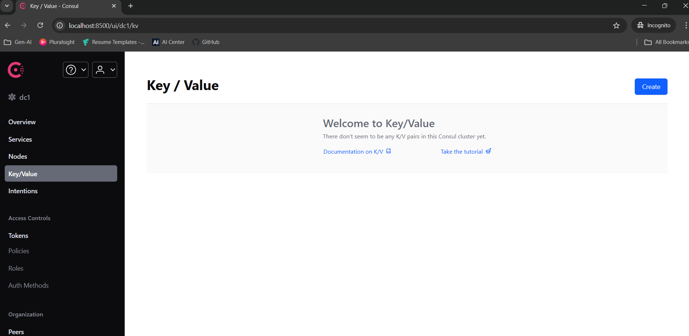

<p align="center">
  <br/><br/>
  
</p>


<h1 align="center">Centralised Configuration Management with Consul</h1>

<p align="center">
  <br/><br/>
</p>


## What is Centralised Configuration:

In modern microservice architectures, multiple applications often share common configuration data (e.g., database settings). These might be multiple instances of the same service or entirely different services. Regardless of the service behavior, instead of maintaining configuration at the service level, we can centralize it in one place and distribute it across all services. HashiCorp Consul provides a solution for this.


The beauty of this approach is that configuration changes can be made on the fly and will immediately reflect in the services.

Now, let's check out how this works in Spring Boot applications.

## ✅ Benefits:
1. Centralized configuration management for all services
2. Service-specific configurations for multiple instances
3. Global configurations shared across all applications
4. Environment-specific configuration support (e.g., dev, qa, prod)
5. Ability to modify configurations on the fly with immediate effect


## 📘 Libraries:
* Consul Server
* Spring Boot
* Spring Cloud Gateway
* Spring Cloud Consul
* Spring Boot Actuator

## 🛠️ Setting Up:
The architecture includes two components.
* Consul server
* User application (a consumer application)


## 1) Consul:
We need to download and configure the Consul service from the official HashiCorp Consul website.
<br>[Download link ](https://developer.hashicorp.com/consul/install)
<br>
For development purposes on Windows, you can start Consul by running below command in PowerShell.

```powershell
consul agent -dev
``` 
Once it successfully started you can see the dashboard in the browser using following url. 8500 is the default port of consul.

http://localhost:8500/

### 🖥️ Consul dashboard
Let's add some configuration into consul through dashboard. We can add it through the CLI as well. Here we are adding it as a key value pair where `Key` will be the path and `Value` will have configuration.
There is an option to add `Key/Value` data, located on the left side of the dashboard.

<p align="center">
  
</p>
<p align="center">
  
</p>

We are adding 3 set of `Key/Value` data to Consul.
1. - Key
        ```properties
        config/user-app,dev/app.properties
        ```
   - Value
        ```properties
        server.port=3602
        sample.config.1=Test data 111
        sample.config.2=Test data 222
        sample.config.3=Test data 333
        sample.config.4=Test data 444
        message=Dev configuration of user-app !!
        ```
2. - Key
        ```properties
        config/user-app/app.properties
        ```
   - Value
        ```properties
        server.port=3601
        sample.config.1=Test data 11
        sample.config.2=Test data 22
        sample.config.3=Test data 33
        sample.config.4=Test data 44
        message=Default configuration of user-app !!
        ```
3. - Key
        ```properties
        config/application/app.properties
        ```
   - Value
        ```properties
        server.port=3600
        sample.config.1=Test data 1
        sample.config.2=Test data 2
        sample.config.3=Test data 3
        sample.config.4=Test data 4
        message=Common config for all apps !!
        ```


📌 Please note that all of the above data is added only for demonstration purpose

### 🧬 Working
- The Logic is very simple, similar to legacy property (or yaml) configuration of spring boot application.
- The first one `config/user-app,dev/app.properties` is specifically created for `development` env of `user-app` named services.
- The second one `config/user-app/app.properties` is created for saving common configurations for `user-app` named services.
- And the last one `config/application/app.properties` is the kind of common configuration which can be served across all services.


## 2) User application (a consumer application):
We have to create a simple spring boot webservice application. Here, it will consume the configuration those are configured in `consul`.

### 🧱 Maven Configuration
We need to add below dependency to enable the communication and share the configuration between `consul`  and `User application` .
```xml
<dependency>
    <groupId>org.springframework.cloud</groupId>
    <artifactId>spring-cloud-starter-consul-config</artifactId>
</dependency>
```

### 🧱 Application Property File
```properties
    #Application name
    spring.application.name=user-app
    
    # Informing the spring boot application to import the configurations from consul
    spring.config.import=consul:
    
    logback.log.file.path=./logs/service
    
    # To enable extra logs
    logging.level.org.springframework.cloud.consul.config=DEBUG
    
    # Consul Configuration
    spring.cloud.consul.host=localhost
    spring.cloud.consul.port=8500
    
    # Enabling Consul configuration management
    spring.cloud.consul.config.enabled=true

    # Declaring the config data format (propreties or yaml)
    spring.cloud.consul.config.format=properties

    # Declaring the prefix of all config key
    spring.cloud.consul.config.prefix=config

    # Declaring the data file name which contains configuration
    spring.cloud.consul.config.data-key=app.properties

    # Declaring the default config path
    spring.cloud.consul.config.default-context=application

    # It will be used for separating the keyword of profile in consul (Eg :config/user-app,dev/app.properties )
    spring.cloud.consul.config.profile-separator=,
    
    # Informing spring boot to load config from dev env
    spring.profiles.active=dev
```
- Here in above configuration, The `consul` will look for the key `config/user-app,dev/app.properties` and return it's `Value` to spring boot application. Why because,
- The prefix of Key mentioned as `spring.cloud.consul.config.prefix=config`
- The application name is configured as `spring.application.name=user-app`
- The profile separator mentioned as `spring.cloud.consul.config.profile-separator=,`
- The active profile configured as  `spring.profiles.active=dev`
- And finally, the data file name mentioned as `spring.cloud.consul.config.data-key=app.properties`
- If any of the expected properties are not found in `config/user-app,dev/app.properties`, the system will then check `config/user-app/app.properties`. If the property is still not found, it will fall back to the common configuration at `config/application/app.properties`.


### 🔄 Auto refresh of Configuration
This is enabled by adding a annotation called `@RefreshScope` in class level where ever we are using the data from property file. 
```Java

@RestController
@RefreshScope
public class Controller {

    private static final Logger logger = LoggerFactory.getLogger(Controller.class);
    private final PortListener portListener;

    public Controller(PortListener portListener) {
        this.portListener = portListener;
    }

    @Value("${message:Default}")
    String testMessage;
    @Value("${sample.config.1:Default}")
    String sampleConfig1;
    @Value("${sample.config.2:Default}")
    String sampleConfig2;
    @Value("${sample.config.3:Default}")
    String sampleConfig3;
    @Value("${sample.config.4:Default}")
    String sampleConfig4;

    // config from the common config of all apps
    @Value("${global.config:Default}")
    String globalConfig;

    @GetMapping(value = "getStatus", produces = MediaType.APPLICATION_JSON_VALUE)
    public Mono<ResponseEntity<Object>> healthCheck() {
        logger.info("<--- Service to get status request : received --->");

        List<String> stringList = new ArrayList<>();
        stringList.add("Message: "+testMessage);
        stringList.add("Application is running under port: "+portListener.getPort());
        stringList.add("Global :"+globalConfig);
        stringList.add(sampleConfig1);
        stringList.add(sampleConfig2);
        stringList.add(sampleConfig3);
        stringList.add(sampleConfig4);
        logger.info("<--- Service to get status response : given --->");

        return Mono.just(ResponseEntity.ok(stringList));
    }
}

```
That is all 🚀. Thanks for reading !! 💖.


